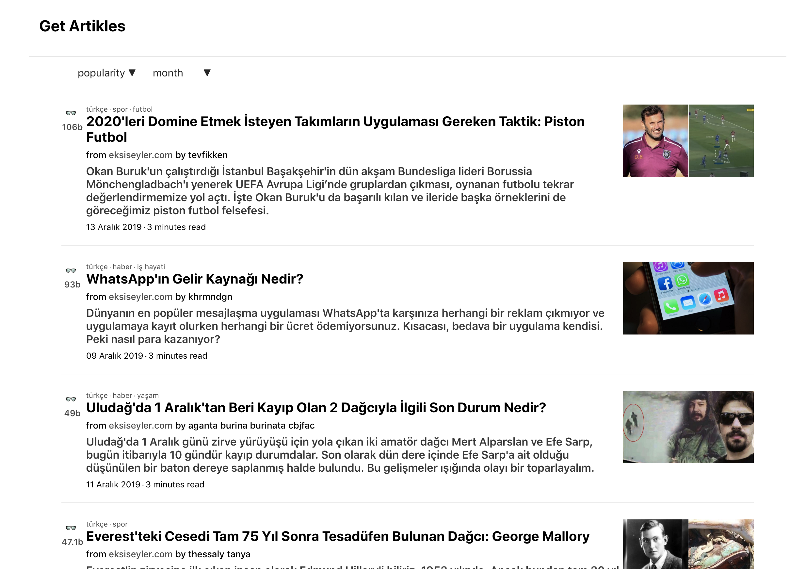

[](https://app.netlify.com/sites/happy-heisenberg-537d44/deploys)

# Mail Me Articles - Frontend

## Description

Mail Me articles is a social platform that aggregates articles all
around the internet specifically tailored for your interests. Try it now at
[getartikles.com](getartikles.com)



## Initializing your local environment for development

### Prerequisites

You need to install `node` or (v12 or newer) and `npm`.

- For **Ubuntu** or Ubuntu based Linux distros:

  ```sh
  sudo apt-get update
  sudo apt-get install nodejs npm
  npm install npm@latest -g
  ```

- For **MacOS** you can use [Homebrew](https://brew.sh/):

  ```sh
  brew install node
  ```

- For **Windows**
  - You should download it manually by hand. Go to this link:
    https://nodejs.org/en/#home-downloadhead
  - Or you can always try [this
    option](https://www.google.com/search?q=how+to+install+linux)
    ☺️
- For **other Operating systems** you can check this
  [link](https://nodejs.org/en/download/package-manager/) from
  nodejs

### Installing and starting the dev server

```sh
git clone http://160.75.154.12/bitbucket/scm/mma/mma-fe.git
cd mma-fe
npm install
npm start
```

## License

Copyright © 2019, Mail Me Articles.
